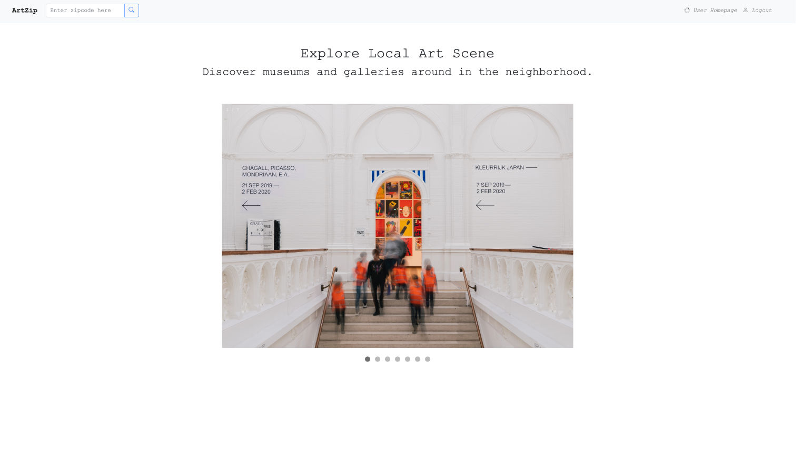
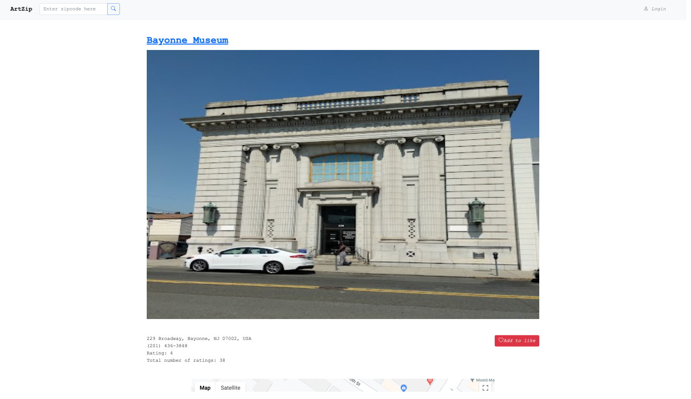

# ArtZip - Discover Art and Culture in Your Neighborhood

ArtZip is a user-friendly web application that helps users find museums and art galleries near their location based on their zip code. The application provides a range of features, including:

- User login/logout
- Create account
- Change password
- Show password (in the change password section)
- Search museum
- Load additional search results
- Show museum location on the Google map
- Like museum

Users can sign up for an account and log in to ArtZip to access additional features, such as liking their preferred museums, which will be added to their liked museum list. The search function allows users to find museums and art galleries based on their zip code, and they can load additional search results to view more options. Additionally, ArtZip provides a map feature that displays the location of each museum, making it easy for users to plan their visits.

# Getting Started

To use ArtZip, simply enter your zip code into the search bar and click "Search". You will be shown a list of museums in your area, along with their addresses, rating, and a link to their official website.

# Dependencies

ArtZip is built using the following technologies:

- Python
- Javascript
- Flask
- SQLAlchemy
- Jinja
- Ajax
- HTML
- CSS
- Bootstrap
- Google Map API(Map api, places api, geocoding api)

# Demo

- Home page

- Login page

- Create account page

- User home page 1

- User home page 2(change password)

- Search results page

- Museum detail page 1

- Museum detail page (google map)

